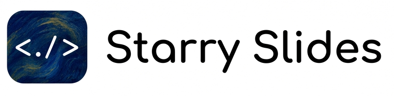

<p align="center">
  
</p>

<p align="center">
  <a href="https://www.npmjs.com/package/starry-slides">
    
  </a>
</p>

<p align="center">
  <a href="./README.md">English</a> | 简体中文
</p>

Starry Slides 是一个基于 AI Agent 的幻灯片/演示文稿编辑器，让你的 Agent 使用 HTML 作为源文件生成完全可编辑的 PPT。

## Features

<table>
  <thead>
    <tr>
      <th align="left">特性</th>
      <th align="left">说明</th>
    </tr>
  </thead>
  <tbody>
    <tr>
      <td><strong>HTML 作为源文件</strong></td>
      <td>Slides 直接使用 HTML 编写，原始格式开放、可检查、也便于版本管理。</td>
    </tr>
    <tr>
      <td><strong>完全可编辑的 PPT</strong></td>
      <td>生成出来的 deck 不是一次性产物。你可以打开它、继续修改它，并持续进行可视化编辑。</td>
    </tr>
    <tr>
      <td><strong>所见即所得的编辑器</strong></td>
      <td>直接在可视化编辑界面中修改 slides，边编辑边看到最终效果，同时保留底层 HTML 源文件。</td>
    </tr>
    <tr>
      <td><strong>用户可控的上下文</strong></td>
      <td>Starry Slides 不内置模板，也不内置样式说明。它只提供让 slides 变得可编辑的能力，设计风格和内容完全由你自己提供的 context 来掌控。</td>
    </tr>
    <tr>
      <td><strong>使用你自己的 Agent</strong></td>
      <td>继续使用你现有的 Agent 即可。Starry Slides 只补充 slides 工作流，不额外引入新的 Agent 层。</td>
    </tr>
  </tbody>
</table>

## 安装 Skill 到你的 Agent

```bash
npx skills add StarryKit/starry-slides --skill starry-slides
```

## Skill 用法

### 最简单的请求

`/starry-slides` skill 内置了 interview workflow，会先收集你的需求再开始生成。

```text
/starry-slides to create a slide deck for my presentation.
```

### 更具体一点的 deck 请求

```text
/starry-slides 帮我生成一个讲解大模型知识的 slides。

具体要求如下：
1. 篇幅：大概需要 8 页
2. 风格：极简风格
3. 场景：我需要在会议上做一次 presentation，面向参会观众进行讲解
```

### 按你喜欢的模板或风格来生成

```text
/starry-slides 帮我参考这个 frontend-slides 里的样式设计，做一个 8 页的 slides，主要讲解大模型的工作原理。https://github.com/zarazhangrui/frontend-slides 这个里面的 Split Pastel 样式
```

### 修改已有 deck

```text
/starry-slides 帮我把这份 PPT 修改成更加高级和现代的风格，缩短内容长度但保证内容质量。
```

## Documentation

- [CLI Usage](./skills/starry-slides/references/STARRY-SLIDES-CLI-USAGE.md)：`starry-slides` CLI 的安装、命令说明和示例。
- [Roadmap](./docs/roadmap/README.md)：项目路线图和后续计划。
- [Development guide](./docs/development.md)：仓库结构、本地命令、测试方式和实现边界。
- [Contributing guide](./docs/contributing.md)：提交变更、验证和评审的基本要求。
- [Slide Contract guide](./skills/starry-slides/references/STARRY-SLIDES-CONTRACT.md)：deck package 结构和必需的 HTML 属性。
- [Repository context](./CONTEXT.md)：仓库规则、边界、测试要求和共享术语。
- [Architecture decisions](./docs/adr/)：已采纳的 ADR 和 ADR 模板。

## License

Starry Slides 使用 [MIT License](./LICENSE)。
